# Lab Report 1   
## Jon Fisher  - A18011764

## Introduction

For this week's lab, we focues on learning github basics, as well as the Unix filesystem commands `cd`, `ls`, and `cat`. The labs primary objective was to familiarize us with github, and the basic command-line operations. Through this lab, I have gained more understanding in regards to nagivating directories, listing contents, viewing file content, as well as setting up github repositories, uploading files, and creating pages. 

## 1. `cd` command
The `cd` command is used to change the current working directory in the unix file system.
-   ### No argument example and `cd`:
    -   Path before command: `C:\Users\jonfi`
    -   `cd` with no argument will change the current directory to the users home directory. 
    -   in powershell, using `cd ` with no argument will not do anything.
    -   this command does NOT result in an error.
    - image: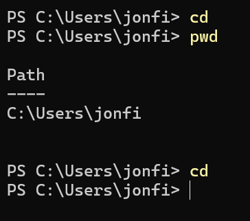

-   ### Directory as an argument:
    -   Path before command: `C:\Users\jonfi`
    - `cd documents` will change the current directory to the 'Documents' directory.
    - image: 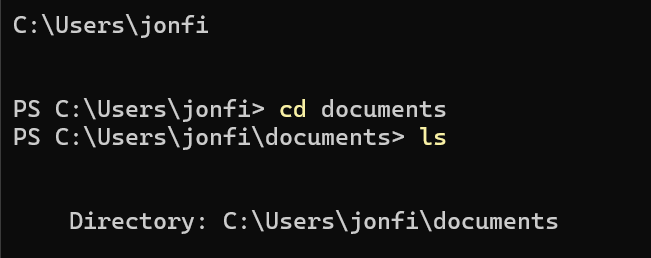

-   ### Non existant argument:
    -   Path before command: `C:\Users\jonfi\documents`
    - `cd nonexistent` will cause an error since the specified directory does not exist in the current directory.
    - image: 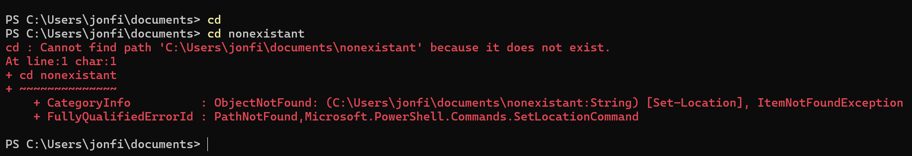
-   ### File as argument: 
    -   Path before command: `C:\Users\jonfi\desktop\ucsd\cse15l\lab_reports`
    -   using `cd test.md` is using the 'change directory' command on a file instead of a directory. This results in an error because the `cd` command is meant for directories, not files.
    -   image: 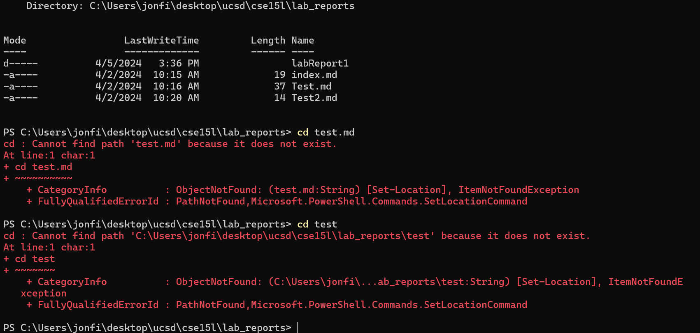

---
### 2. `ls` command
-   ### No argument:
    -   Path before command: `C:\users\jonfi\desktop\ucsd\cse15l`
    -   `ls` will output and list all visible files and directories in the current working directory.
    -   image: 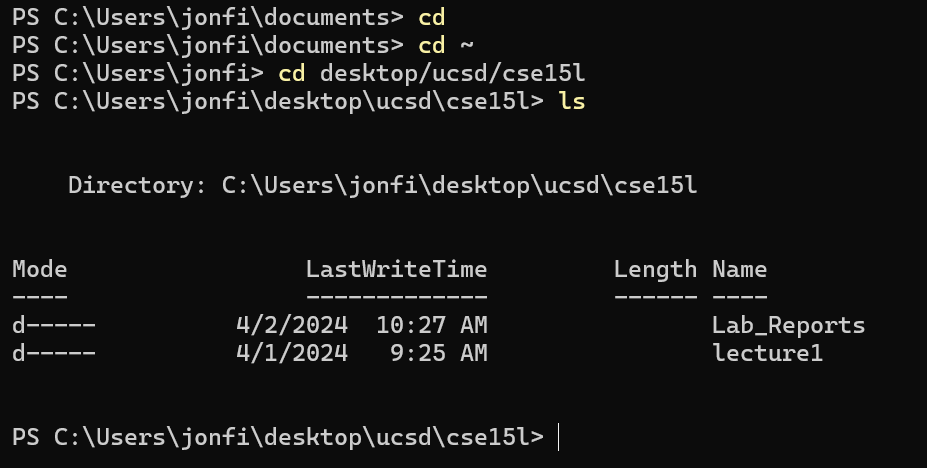

-   ### directory path as argument:
    -   Path before command: `C:\users\jonfi\desktop\ucsd\cse15l`
    -   `ls lecture1` will display the contents of that directory without changing the directory to that path. This is useful to inspect contents before navigating to directories. 
    -   image: 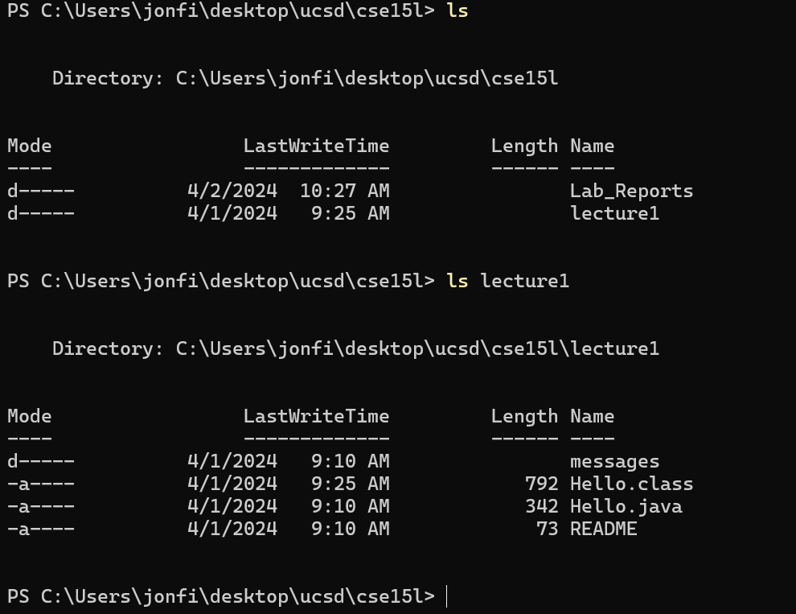

-   ### Non existant argument:
    -   Path before command: `C:\users\jonfi\desktop\ucsd\cse15l`
    -   `ls nonexistent` will cause an error since the specified directory does not exist.
    -   image: 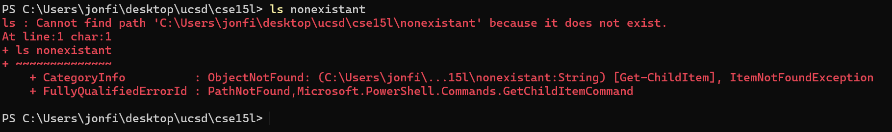

-   ### file as argument:
    -   Path before command: C:\users\jonfi\desktop\ucsd\cse15l\lab3
    -   `ls hello.txt` will show the file information and the length of the file.
    -   image: 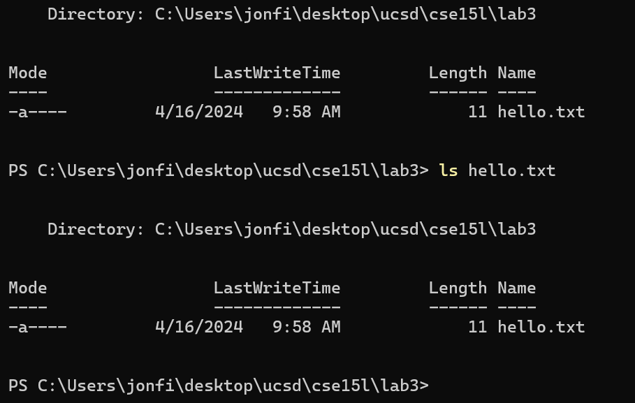

---
### 3. `cat` command
-   ### printing contents of file
    -   Path before command: `C:\users\jonfi\desktop\ucsd\cse15l\lab_reports\labReport1`
    -   `cat cat1.txt` and `cat cat2.txt` will output the contents of the text files.
    -   image: 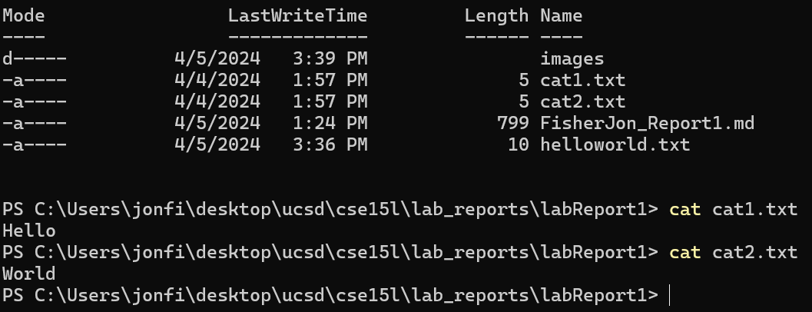

-   ### concatinate example
    -   Path before command: `C:\users\jonfi\desktop\ucsd\cse15l\lab_reports\labReport1`
    -   using `cat cat1.txt cat2.txt > helloworld.txt` will combine the contents for the two files into a new file named helloworld.txt.
    -   image: 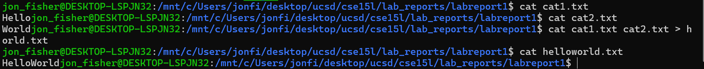

-   ### non existent argument
    -   Path before command: `C:\users\jonfi\desktop\ucsd\cse15l\lab_reports\labReport1`
    -   using `cat nonexistent` will cause an error since the specified file does not exist.
    - image: 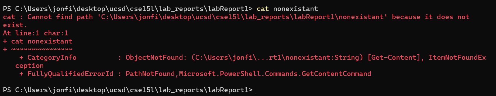

-   ### directory as argument
    -   Path before command: `C:\users\jonfi\desktop\ucsd\cse15l\lab_reports\labReport1`
    -   using `cat images` to try and print the contents of the images directory will result in an error. Even though the directory exists, cat will result in an error.
    -   image: 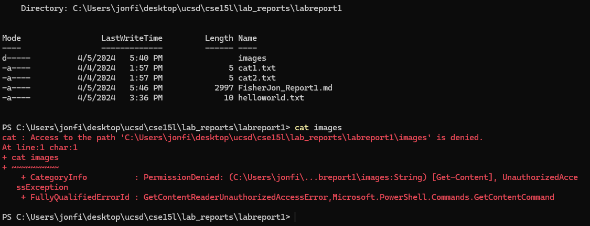
  
-   ### no argument
    -   Path before command: `C:\Users\jonfi\desktop\ucsd\cse15l\lab_reports\labreport1`
    -   using `cat  ` with no argument will read data from its standard input and write them to its standard output. It will wait for you to input stuff. This is not very useful for the most part.
    -   image: 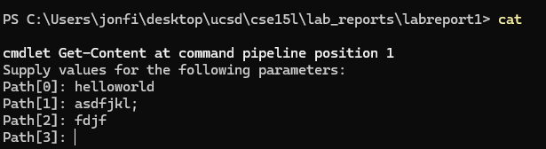
  
---
# Conclusion:
This lab's objective was to develop a foundational understanding of basic Unix filesystem commands (`cd`, `ls`, and `cat`) and to introduce essential GitHub operations. 

The exercises demonstrated the utility of the commands in file system navigation and manipulation, providing insight into common operational errors such as attempting to navigate into a file with `cd` or listing no-existent directories. Furthermore, the lab went over the functionality of GitHub for repository management and publication of content using GitHub Pages.

The completion of this lab has established some foundational experience in Unix command line proficiency and GitHub usage. These skills are essential for software development.