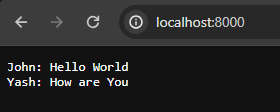
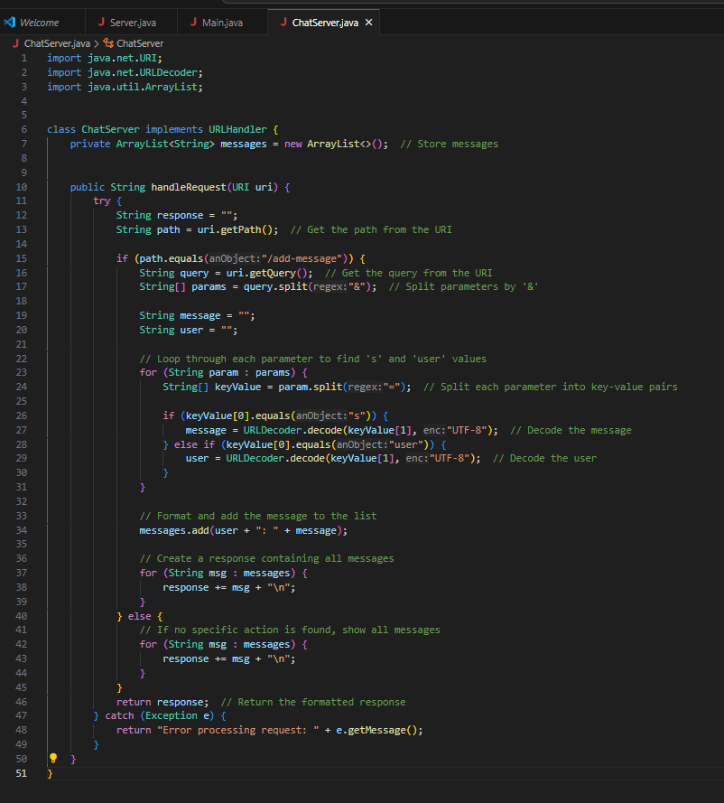

# Lab Report 2  
## Jon Fisher  - A18011764

## Introduction

For this week's lab, we focues on learning about ChatServers and hosting them. 

## Part I
-   image: 
-   image: 
-   image: 

---

### Example 1: Adding a Message
-   Request: A user accesses the URL http://localhost:8000/add-message?s=Hello%20World&user=John.

#### Which methods in your code are called?
-   handleRequest(URI uri) from the ChatServer class.
#### What are the relevant arguments to those methods, and the values of any relevant fields of the class?
-   Arguments:
    -   URI uri: An object representing the URI accessed, which in this case would be something like URI("http://localhost:8000/add-message?s=Hello%20World&user=John").
-   Values:
ArrayList<String> messages: This field holds the chat messages. Before this request, let's assume it's empty ([]).
#### How do the values of any relevant fields of the class change from this specific request?
-   The messages ArrayList initially is empty. After processing this request where the user "John" says "Hello World", the ArrayList will have one element:
Before: []
After: ["John: Hello World"]

--- 
### Example 2: Viewing Messages
-   Request: Another request is made to the URL http://localhost:8000/ just to view messages.

#### Which methods in your code are called?
handleRequest(URI uri) from the ChatServer class.
#### What are the relevant arguments to those methods, and the values of any relevant fields of the class?
-   Arguments:
URI uri: An object representing the URI accessed, which in this case would be URI("http://localhost:8000/").
-   Values:
ArrayList<String> messages: Holds the chat messages, which now contains ["John: Hello World"].
#### How do the values of any relevant fields of the class change from this specific request?
-   The messages ArrayList does not change because this request is only viewing the messages. Therefore, the state of messages remains:
Before and After: ["John: Hello World"]
Explanation
-   handleRequest Method:
It checks the path of the URI and either adds to the messages ArrayList or simply formats the existing messages for display.
When adding a message, it parses the query string, decodes parameters, and constructs the message string to add to messages.
When viewing messages, it constructs a response string from the current contents of messages without modifying it.
---
## Part II

  #### `ls` with the absolute path to the private key for your SSH key for logging into ieng6
 

#### On the command line of the ieng6 machine, run `ls` with the absolute path to the public key for your SSH key for logging into ieng6

---
## Part III: Things I learned in weeks 2 and 3

#### Understanding URLs and Servers:
-   Learned about the structure and function of URLs in web development.
Gained practical experience in setting up and running a web server using Java, specifically handling HTTP requests and responses.  

#### Remote Server Connection:
-   Practiced remotely connecting to a CSE15L account using SSH, familiarizing with the process and potential security prompts.
Understood the significance of the RSA key fingerprint and the security implications of accepting it.

#### Building a Simple Web Server:
-   Implemented a basic web server that can handle specific URL paths and query parameters.
Explored the interaction between client requests and server responses through a simple number managing system.