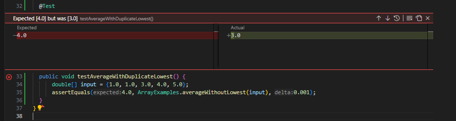
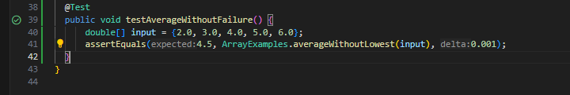

# Lab Report 3  
## Jon Fisher  - A18011764

## Introduction


## Part I
  1. #### A failure-inducing input for the buggy program, as a JUnit test and any associated code (write it as a code block in Markdown).

             @Test
            public void testAverageWithDuplicateLowest() {
                double[] input = {1.0, 1.0, 3.0, 4.0, 5.0};
                assertEquals(4.0, ArrayExamples.averageWithoutLowest(input), 0.001);
            }
---
2. #### An input that doesn't induce a failure, as a JUnit test and any associated code (write it as a code block in Markdown).
   
        @Test
       public void testAverageWithoutFailure() {
           double[] input = {2.0, 3.0, 4.0, 5.0, 6.0};
           assertEquals(4.5, ArrayExamples.averageWithoutLowest(input), 0.001);
       }
---
3. #### The symptom, as the output of running the two tests above (provide it as a screenshot -- one test should pass, one test should fail).

    Test Fail: 

    Test Pass: 

---
4. #### The bug, as the before-and-after code change required to fix it (as two code blocks in Markdown).

* Before:
    
        static double averageWithoutLowest(double[] arr) {
        if(arr.length < 2) { return 0.0; }
        double lowest = arr[0];
        for(double num: arr) {
        if(num < lowest) { lowest = num; }
        }
        double sum = 0;
        for(double num: arr) {
        if(num != lowest) { sum += num; }
        }
        return sum / (arr.length - 1);
         }

* After:

        static double averageWithoutLowest(double[] arr) {
        if(arr.length < 2) { return 0.0; }
        double lowest = arr[0];
        for(double num: arr) {
        if(num < lowest) { lowest = num; }
        }
        double sum = 0;
        boolean skipped = false;
        for(double num: arr) {
        if(num == lowest && !skipped) {
            skipped = true; // Skip only the first occurrence of the lowest value
        } else {
            sum += num;
        }
        }
        return sum / (arr.length - 1);
      }

---
5. 
#### 5. Explanation

The original `averageWithoutLowest` method failed to handle arrays with duplicate lowest values correctly; it would exclude all instances of the lowest number. The corrected code introduces a boolean flag to skip only the first occurrence of the lowest value. This change ensures that the average calculation includes all but one of the duplicate lowest values, accurately reflecting the intended functionality.

---
---

## Part 2 - Researching Commands: Exploring the `find` Command

The `find` command is important for navigating and managing the filesystem in Unix-like operating systems. It allows users to locate files and directories based on conditions specified by the user, such as file name, modification time, type, and content, among others. 

### Option 1: `-type`
**Purpose**: The `-type` option is used to filter search results based on the type of file, such as regular files (`f`), directories (`d`), or symbolic links (`l`).

**Example 1: Finding All Directories**
```bash
find ./technical -type d
```
This command lists all directories under the `./technical` directory. It is useful for obtaining a clear view of the directory structure of a project.

**Example 2: Finding All Regular Files**
```bash
find ./technical -type f
```
This command lists all regular files within the `./technical` directory, aiding in quickly assessing the files present without the interference of directories.

### Option 2: `-maxdepth`
**Purpose**: The `-maxdepth` option limits the depth of directories that `find` will search into, providing a means to constrain the search to a specific level of the directory tree.

**Example 1: Find Directories Only at the Top Level**
```bash
find ./technical -maxdepth 1 -type d
```
This command lists directories at the top level of `./technical`. It is particularly useful when one needs to quickly identify the primary organizational units within a project without delving into nested directories.

**Example 2: Find Files in the First Two Levels of Directories**
```bash
find ./technical -maxdepth 2 -type f
```
This command restricts the search to files located within the top level and one subdirectory level of `./technical`, making it easier to manage the scope of search results.

### Option 3: `-mtime`
**Purpose**: The `-mtime` option is used to find files based on the time they were last modified. It takes a numeric argument, which can be prefixed with a plus (`+`) to indicate more than or a minus (`-`) to indicate less than the specified number of days.

**Example 1: Files Modified in the Last 7 Days**
```bash
find ./technical -mtime -7 -type f
```
This command locates files in `./technical` that have been modified in the last week. This is useful for reviewing recent changes or updates.

**Example 2: Files Not Modified in the Last 30 Days**
```bash
find ./technical -mtime +30 -type f
```
This command helps identify files that have not been modified in the past month, which can be helpful for cleaning up old or unused files.

### Option 4: `-exec`
**Purpose**: The `-exec` option allows the user to execute a command on each file found. This adds a powerful layer of functionality to file searches, enabling direct interaction with search results.

**Example 1: Find Files Containing a Specific Keyword**
```bash
find ./technical -type f -exec grep -Hi "function" {} \;
```
This command searches for the word "function" in all files under `./technical`, displaying lines from files where the word appears. This is particularly valuable for developers looking for specific implementations in codebases.

**Example 2: Count Lines in Found Files**
```bash
find ./technical -type f -exec wc -l {} \;
```
This command counts the lines in each file found under `./technical`, providing insights into file sizes and content volumes.

### Sources
The examples and explanations for the `find` command options were informed by the article "10 ways to use the Linux find command" from Red Hat, accessed online at [Red Hat's website](https://www.redhat.com/sysadmin/linux-find-command).
