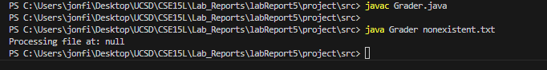
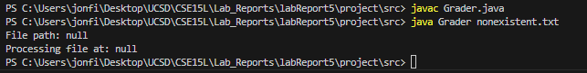

# Lab Report 5 - Putting it All Together (Week 9)

## Part 1 – Debugging Scenario

### Original Post from a Student

**Post Title:** Help Needed with Java Grader Script Bug

**Post Content:**
Hi everyone,

I'm having trouble with my Java grading script. It seems to be crashing when it processes a specific input file. I've attached a screenshot of the terminal output. I suspect the issue might be with how the script handles file paths, but I'm not sure. Any help would be greatly appreciated!



**Terminal Output:**
```
PS C:\Users\jonfi\Desktop\UCSD\CSE15L\Lab_Reports\labReport5\project\src> javac Grader.java
PS C:\Users\jonfi\Desktop\UCSD\CSE15L\Lab_Reports\labReport5\project\src> 
PS C:\Users\jonfi\Desktop\UCSD\CSE15L\Lab_Reports\labReport5\project\src> java Grader nonexistent.txt
Processing file at: null
PS C:\Users\jonfi\Desktop\UCSD\CSE15L\Lab_Reports\labReport5\project\src> 
```

---
### Response from a TA

**TA Response:**

Hi there,

It looks like you're encountering a `NullPointerException`. This often happens when the code tries to use an object reference that hasn't been initialized. Can you try running the script with the `-Xdebug` flag to get more detailed output? Also, can you print the value of the file path before line 45 in your `Grader.java` file to check if it’s `null`?

### Additional Information from Student

**Post Content:**

Thanks for the suggestion! I ran the script with the `-Xdebug` flag and added a print statement before line 45. Here is the updated output.

**Updated Terminal Output:**
```
File path: null
Exception in thread "main" java.lang.NullPointerException
at Grader.processFile(Grader.java:45)
at Grader.main(Grader.java:20)
```


It looks like the file path is `null`. How should I fix this?

---
### TA Follow-Up

**TA Response:**

Great, now we know the file path is `null`. This suggests that the file path isn't being set correctly. Check how you're initializing the file path variable. It might be helpful to share the relevant part of your `Grader.java` code here.

---
### Code and Bug Description

## **Student Post:**

Here is the part of my `Grader.java` code where the file path is set:

```java
public class Grader {
    public static void main(String[] args) {
        String filePath = getFilePath(args[0]);
        processFile(filePath);
    }

    public static String getFilePath(String fileName) {
        File file = new File("../submissions/" + fileName);
        if (file.exists()) {
            return file.getAbsolutePath();
        } else {
            return null;
        }
    }

    public static void processFile(String filePath) {
        // Line 45: File processing logic
        System.out.println("Processing file at: " + filePath);
        // More processing code...
    }
}

```
---
## Final Debugging Scenario Information
File & Directory Structure Needed:
```
project/
├── submissions/
│   └── sample.txt
└── src/
    └── Grader.java
```

## Contents of Grader.java before fixing the bug:

```java
public class Grader {
    public static void main(String[] args) {
        String filePath = getFilePath(args[0]);
        processFile(filePath);
    }

    public static String getFilePath(String fileName) {
        File file = new File("../submissions/" + fileName);
        if (file.exists()) {
            return file.getAbsolutePath();
        } else {
            return null;
        }
    }

    public static void processFile(String filePath) {
        // Line 45: File processing logic
        System.out.println("Processing file at: " + filePath);
        // More processing code...
    }
}
```

## Full Command Line to Trigger the Bug:
```
javac src/Grader.java
java -cp src Grader sample.txt
```

## Description of What to Edit to Fix the Bug:
Add a check in the main method to ensure filePath is not null before calling processFile. The updated main method should look like this:
```java
public class Grader {
    public static void main(String[] args) {
        String filePath = getFilePath(args[0]);
        if (filePath != null) {
            processFile(filePath);
        } else {
            System.err.println("Error: File not found.");
        }
    }

    public static String getFilePath(String fileName) {
        File file = new File("../submissions/" + fileName);
        if (file.exists()) {
            return file.getAbsolutePath();
        } else {
            return null;
        }
    }

    public static void processFile(String filePath) {
        // Line 45: File processing logic
        System.out.println("Processing file at: " + filePath);
        // More processing code...
    }
}
```
## successful run after bug fix:

## Error handling:


# Part 2 – Reflection
From my lab experience in the second half of this quarter, I learned about the power and flexibility of Continuous Integration (CI) and autograding systems. I didn't realize before how automating the grading process using bash scripts and JUnit tests could significantly streamline evaluating student code submissions. This knowledge expanded my understanding of how CI tools can be used not just in professional software development but also in educational settings to provide immediate feedback and improve the learning process.


